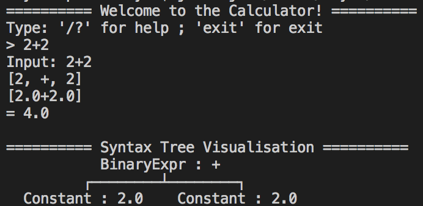
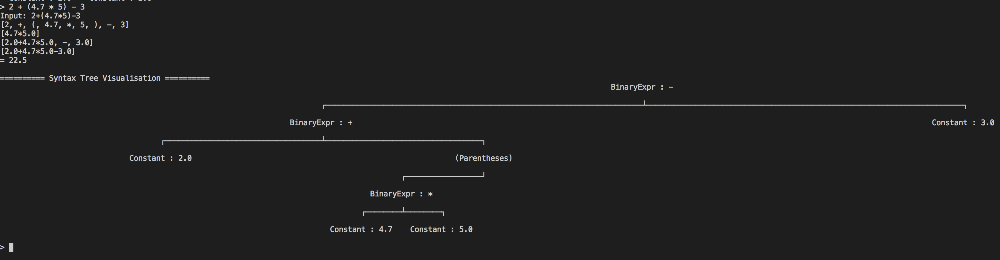
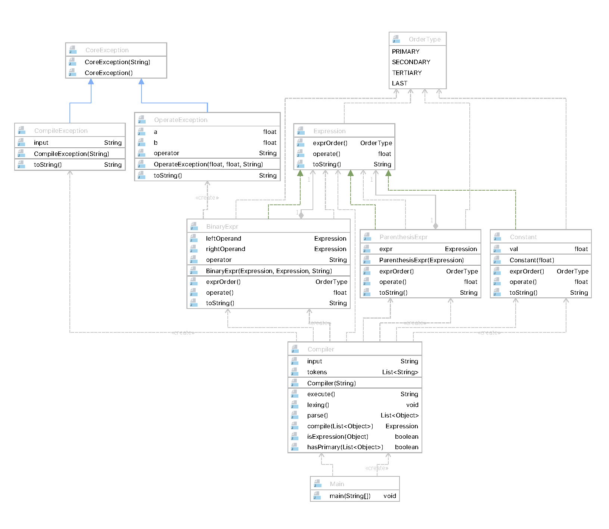
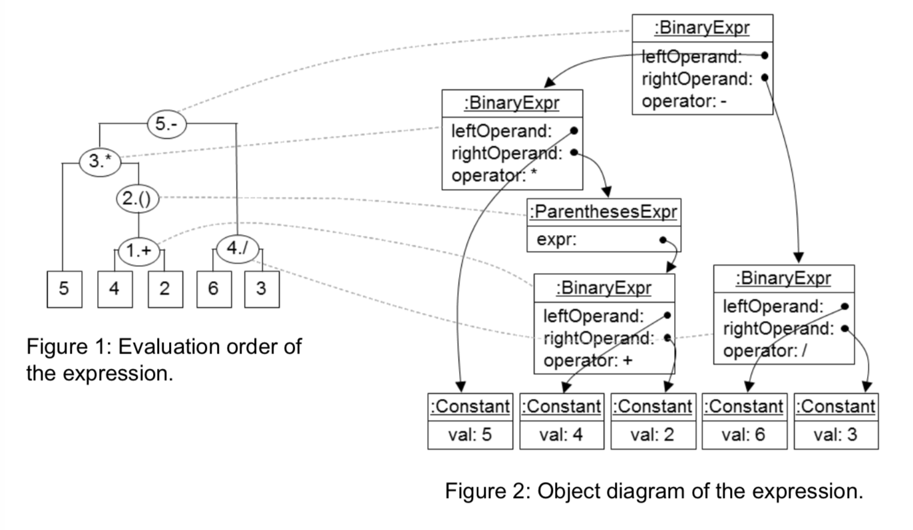

# Calculator Compiler in JAVA

The Calculator consist of five operations :  `+, -, *, ()`

<b style="color:green;">This Calculator Compiler included the visualisation of the syntax tree</b>

It can be extended if you implements other Expression Class.

## Sample Output

1. Simple Output

2. Complex Output

## Structure

1. Compiler act as the Factory to create Expressions from plain text
2. All Expressions are implement one common interface: `Expression`
3. Current Expression includes:
    - Constant
        * A Floating Point Number
    - BinaryExpr
        * Binary Expression 
        * e.g: `1 + 1` or `5 * 3`
        * Operands can be another core.expression, not only constant
    - ParenthesisExpr
        * Will pointed to the core.expression inside the Parenthesis
        * e.g: `(1 + 1)` will pointed to the BinaryExpr of `1 + 1`
        
        
# Design Pattern
1. Factory Pattern
    - From Compiler to create Expressions

## Abstract Syntax Tree

Expression will core.compile into a tree, whole tree will be created recursively in the compiler

## How To Use

- `git clone https://github.com/rayli-bot/Calculator-Compiler`.
- `java -jar /path/to/this/repo/calculator.jar`

### Todo-List

- [X] Tree Visualisation in CLI
- [ ] Calculator in GUI
- [ ] Tree Visualisation in GUI